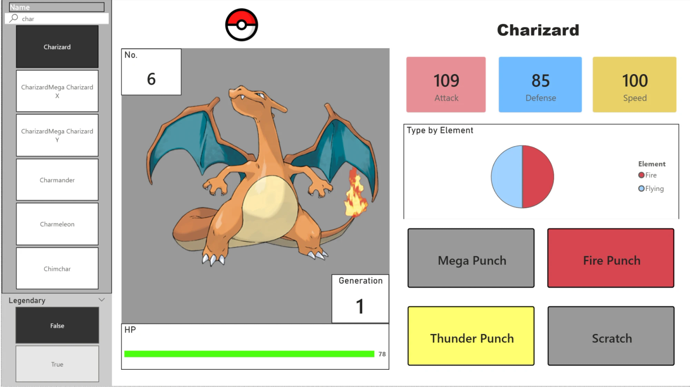
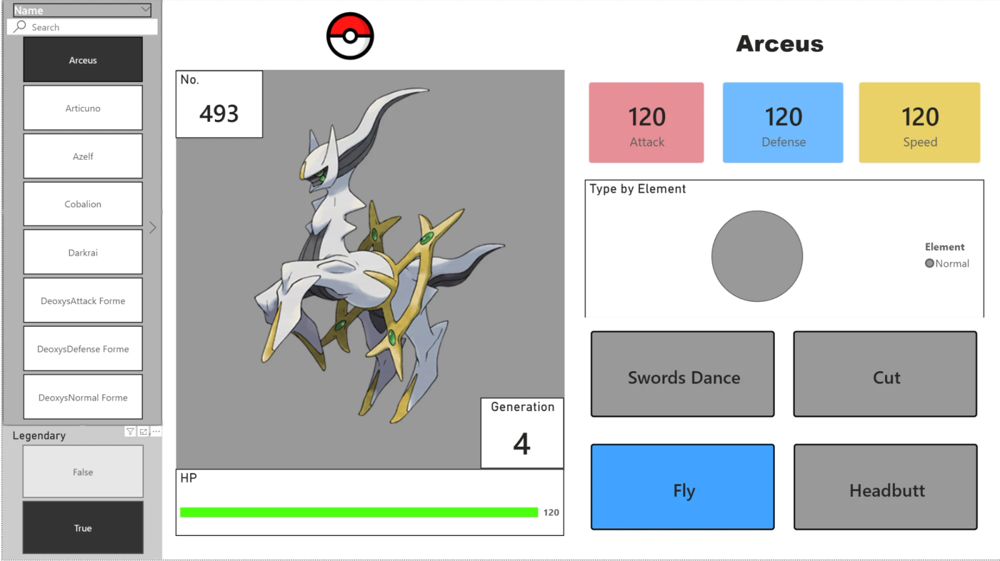
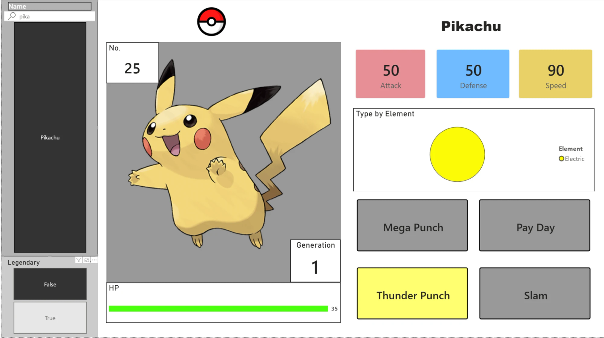

# Pokémon Dashboard (Power BI)

An interactive Pokédex dashboard built in Power BI. Search any of the 800 Pokémon by name to see its artwork, number, generation, HP bar, Attack/Defense/Speed and a type breakdown, plus four moves color-coded by move type. A Legendary filter narrows the list.



| Legendary filter on | Search by name |
|---|---|
|  |  |

## What's inside

| File | What it is |
|---|---|
| `Pokemon Dashboard.pbix` | The Power BI report |
| `Pokemon.xlsx` | The enriched dataset the report reads (800 Pokémon, 22 columns) |
| `Pokemon.csv` | The original base-stats dataset |
| `fix_mega_urls.py` | Adds an official-artwork image URL for every Pokémon, mapping Mega forms to their PokéAPI IDs |
| `fetch_moves.py` | Adds four moves per Pokémon from PokéAPI |
| `fetch_move_types.py` | Adds each move's type from PokéAPI |

## How the data was built

1. Start from the base stats in `Pokemon.csv` (type, HP, Attack, Defense, Sp. Atk, Sp. Def, Speed, generation, legendary), saved as `Pokemon.xlsx`.
2. `fix_mega_urls.py` adds the `ImageUrl` column with each Pokémon's official artwork.
3. `fetch_moves.py` calls PokéAPI and fills `Move 1`–`Move 4`, caching results so Mega forms don't repeat calls.
4. `fetch_move_types.py` looks up each move's type and fills `Move 1 Type`–`Move 4 Type`.

To rebuild the data yourself:

```bash
pip install openpyxl requests
python fix_mega_urls.py
python fetch_moves.py
python fetch_move_types.py
```

## Open the report

Open `Pokemon Dashboard.pbix` in [Power BI Desktop](https://www.microsoft.com/power-platform/products/power-bi/desktop) (free). If it asks for the data source, point it at `Pokemon.xlsx` in this folder.

## Built with

Power BI · Python (openpyxl, requests) · PokéAPI · Excel

## Credits

Moves, move types and artwork come from [PokéAPI](https://pokeapi.co/). Pokémon and Pokémon character names are trademarks of Nintendo, Creatures Inc. and GAME FREAK inc. This is a non-commercial fan project made for learning.
